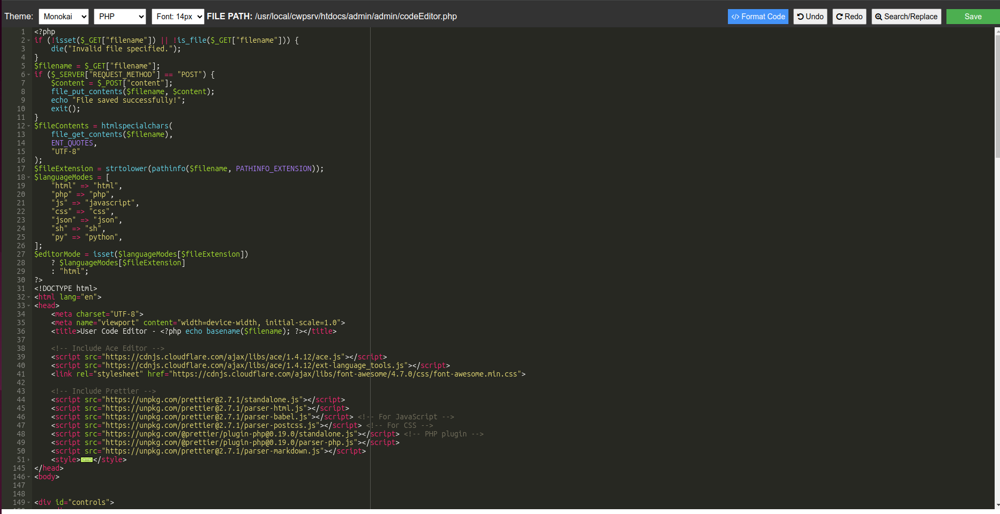

# CWPPro Custom CodeEditor (Based on Ace Editor)
Enhance your CWPPro experience with a customized CodeEditor built using the powerful Ace Editor! This improved code editor offers multiple themes, built-in code formatting, search and replace functionality, and much more

## Overview

This is a highly customizable **CodeEditor** for **CWPPro**, based on the **Ace Editor**. It comes packed with modern features, including multiple themes, code formatting, and much more. It's designed to replace the default CWPPro editor, giving you a more powerful and pleasant coding experience. Say goodbye to the limitations of the default cwp editor—This CodeEditor is designed to provide a modern, efficient, and highly customizable coding experience for developers.



## Features

- **Multiple Themes**: Choose from several beautiful themes, such as Monokai, GitHub, Tomorrow, and Kuroir.
- **Code Formatter**: Automatically format your code using Prettier, ensuring your code is always clean and consistent.
- **Search and Replace**: Easily find and replace text within your code with a built-in search and replace function.
- **Undo/Redo Support**: Never lose your changes with undo/redo functionality.
- **Multiple Language Support**: Supports syntax highlighting and formatting for languages like HTML, JavaScript, PHP, CSS, and more.
- **Responsive and Intuitive UI**: The interface adjusts to different screen sizes, providing a smooth experience.
- **Font Awesome Icons**: Enhanced with stylish icons for better navigation and usability.

## Why Use This Editor?

This custom CodeEditor is a big upgrade from the default editor in CWPPro. With its advanced features and modern UI, it makes coding easier and more efficient. Whether you're a seasoned developer or just starting, this editor will enhance your workflow and improve your productivity.

## Installation Guide

### Step 1: Backup Existing Files

Before proceeding, it's important to back up the existing `codeEditor.php` files for both user and admin to avoid losing your original editor.

Run the following commands to back up the original files:

```bash
sudo cp /usr/local/cwpsrv/var/services/users/codeEditor.php /usr/local/cwpsrv/var/services/users/codeEditor_backup.php
sudo cp /usr/local/cwpsrv/htdocs/admin/admin/codeEditor.php /usr/local/cwpsrv/htdocs/admin/admin/codeEditor_backup.php
```

### Step 2: Download and Install the New CodeEditor
Download the customized `codeEditor.php` from this repository and replace the existing files with it.
```bash
sudo mv /path/to/downloaded/codeEditor.php /usr/local/cwpsrv/var/services/users/codeEditor.php
sudo mv /path/to/downloaded/codeEditor.php /usr/local/cwpsrv/htdocs/admin/admin/codeEditor.php
```

### Step 3: Restart Apache
For changes to take effect, restart Apache:
`sudo systemctl restart cwpsrv`

### Support
If you encounter any issues or have suggestions for improvements, feel free to create an issue in this GitHub repository.

### License
This project is open-source and licensed under the MIT License.

